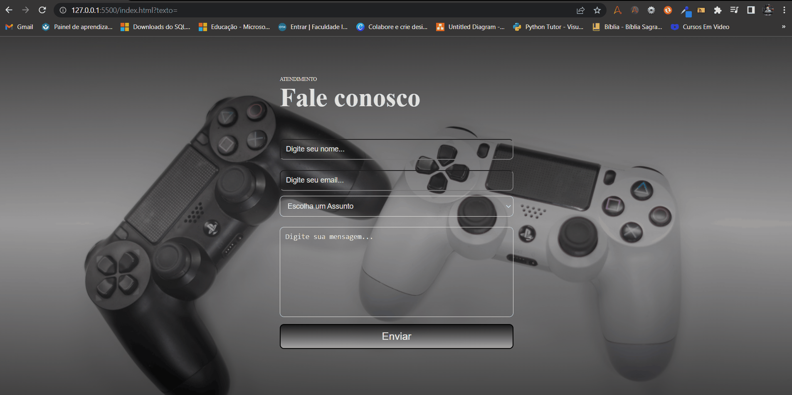

## ✔ Formulário de Contato 

* Nesse formulário o diferencial é a seleção, onde o usuário escolhe o assunto que desenja falar na seção seguinte. 

## Tecnologias utilizadas 

 
  
   

* Veja como ficou 

   
